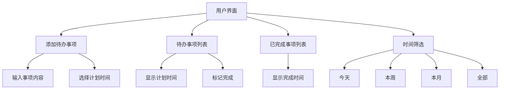

# 移动端待办事项应用开发计划

## 项目结构
```
todo-app/
├── index.html       # 主页面
├── style.css        # 样式表
├── app.js           # 主逻辑
└── README.md        # 项目说明
```

## 功能设计


## 技术实现细节

### 数据结构
```javascript
{
  id: string,          // 唯一ID
  content: string,     // 事项内容
  plannedTime: Date,   // 计划时间
  completed: boolean,  // 是否完成
  completedTime: Date? // 完成时间(可选)
}
```

### 主要功能模块
1. **添加事项**
2. **事项列表展示**
3. **时间筛选功能**
4. **数据存储(localStorage)**

## 移动端优化
- 响应式设计
- 触摸友好的UI
- 移动端日期选择器

## 开发步骤
1. 创建基础HTML结构
2. 添加基本样式
3. 实现JavaScript核心逻辑
4. 添加交互功能
5. 测试和优化